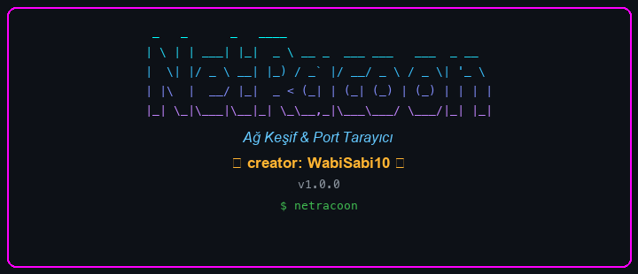
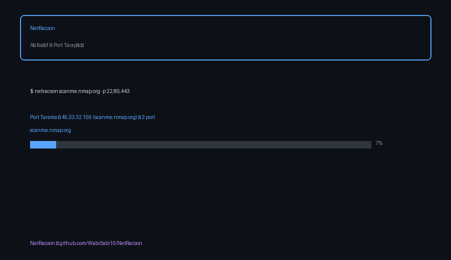

# NetRacoon

<p align="center">
  
</p>

[](https://www.python.org/downloads/)
[](LICENSE)



> **Disclaimer:** Use only on networks you own or have explicit permission to scan.

---

## Features

| Category | Capability |
|----------|------------|
| **Scanning** | Async TCP port scan (default), thread-based fallback (`--sync`) |
| **Discovery** | ICMP ping sweep, CIDR / IP range expansion |
| **DNS** | Forward (A) and reverse (PTR) hostname resolution |
| **Recon** | Service name detection, banner grabbing (HTTP, SSH, SMTP, TLS…) |
| **Profiles** | `quick`, `deep`, `stealth` scan presets |
| **Rate control** | `--rate` (req/s) and `--delay` for ethical scanning |
| **Advanced** | OS fingerprinting (TTL), traceroute, subdomain discovery |
| **Export** | JSON, CSV, HTML report |
| **History** | Save scans, diff against previous results |
| **Config** | YAML config file support |

---

## Architecture

```
┌─────────────┐     ┌──────────────┐     ┌─────────────────┐
│  CLI / YAML │────▶│   Scanner    │────▶│  Async Scanner  │
└─────────────┘     └──────┬───────┘     └─────────────────┘
                           │
          ┌────────────────┼────────────────┐
          ▼                ▼                ▼
   ┌────────────┐  ┌────────────┐  ┌──────────────┐
   │ Ping Sweep │  │ DNS Resolver│  │ Banner Grab  │
   └────────────┘  └────────────┘  └──────────────┘
          │                │                │
          └────────────────┼────────────────┘
                           ▼
              ┌────────────────────────┐
              │ JSON / CSV / HTML      │
              │ Rich Terminal Output   │
              └────────────────────────┘
```

---

## Quick Start

```bash
git clone https://github.com/WabiSabi10/NetRacoon.git
cd NetRacoon
python3 -m venv .venv
source .venv/bin/activate      # Windows: .venv\Scripts\activate
pip install -e ".[dev]"
```

> **Kali Linux / Debian:** Sistem Python'u korumalıdır (`externally-managed-environment`).
> Mutlaka **virtual environment** kullanın — `pip install` önce `source .venv/bin/activate` yapın.
> Proje kök dizininde olun (`~/NetRacoon`), `netracoon/` alt klasöründe değil.

```bash
# Kali — adım adım
cd ~/NetRacoon
python3 -m venv .venv
source .venv/bin/activate
pip install -e ".[dev]"
netracoon --help
```

venv olmadan hızlı test:
```bash
cd ~/NetRacoon
python3 -m venv .venv && source .venv/bin/activate
pip install -r requirements.txt
python3 netracoon.py scanme.nmap.org -p 22,80
```

```bash
# Single host, common ports
netracoon 192.168.1.1

# Specific ports with banner grabbing
netracoon scanme.nmap.org -p 22,80,443

# Ping sweep + port scan (CIDR)
netracoon 192.168.1.0/24 --ping

# Stealth profile (slow, rate-limited)
netracoon 192.168.1.1 --profile stealth

# Full export
netracoon 192.168.1.1 --profile deep -o results.json --csv results.csv --html report.html

# YAML config
netracoon --config netracoon.yaml
```

---

## Scan Profiles

| Profile | Ports | Banner | Rate | Use case |
|---------|-------|--------|------|----------|
| `quick` | Top 20 | Off | Unlimited | Fast recon |
| `deep` | 1–65535 | On | Unlimited | Full audit |
| `stealth` | Top ports | On | 50 req/s | Low-noise scan |

---

## CLI Options

| Option | Description |
|--------|-------------|
| `target` | IP, hostname, CIDR (`192.168.1.0/24`) or range (`192.168.1.1-50`) |
| `-p, --ports` | Port list: `top`, `22,80,443`, `1-1024` |
| `--profile` | `quick` / `deep` / `stealth` |
| `--ping` | Run ping sweep before port scan |
| `-t, --timeout` | Connection timeout (seconds) |
| `-w, --workers` | Concurrent workers |
| `--rate` | Max requests per second |
| `--delay` | Delay between requests (seconds) |
| `-o, --output` | JSON output file |
| `--csv` | CSV output file |
| `--html` | HTML report file |
| `--config` | Load settings from YAML |
| `--os-fingerprint` | OS detection via TTL |
| `--traceroute` | Show network path |
| `--subdomains` | Subdomain enumeration |
| `--log` | Write log to file |
| `--save-history` | Save to `~/.netracoon/history/` |
| `--diff FILE` | Compare with previous scan |
| `--sync` | Use threads instead of asyncio |
| `-v, --verbose` | Line-by-line output |

---

## Docker

```bash
docker build -t netracoon .
docker run --rm --network host netracoon scanme.nmap.org -p 22,80
```

---

## Development

```bash
pip install -e ".[dev]"
pytest --cov=netracoon --cov-report=term-missing
ruff check netracoon tests
mypy netracoon
```

---

## Tech Stack

- **Python 3.10+** — asyncio concurrency, dataclasses, type hints
- **Rich** — terminal UI (tables, progress bars, panels)
- **PyYAML** — config file parsing
- **Jinja2** — HTML report templates
- **pytest** — unit tests with mocked network calls

---

## Project Structure

```
netracoon/
├── async_scanner.py    # Asyncio port scanner
├── port_scanner.py     # Thread-based fallback
├── ping_sweep.py       # ICMP ping sweep
├── dns_resolver.py     # Forward/reverse DNS
├── banner.py           # Banner grabbing
├── services.py         # Service name lookup
├── profiles.py         # Scan profiles
├── config.py           # YAML config loader
├── html_exporter.py    # HTML report
├── history.py          # Scan history & diff
├── os_fingerprint.py   # TTL-based OS guess
├── traceroute.py       # Network path discovery
├── subdomain.py        # Subdomain enumeration
└── cli.py              # CLI entry point
```

---

## License

MIT — see [LICENSE](LICENSE).
